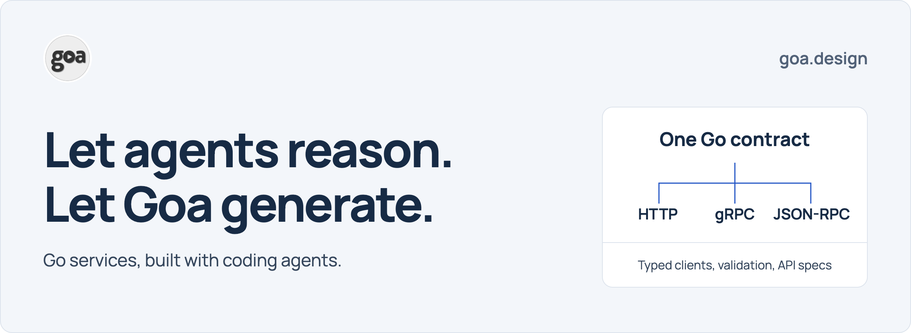
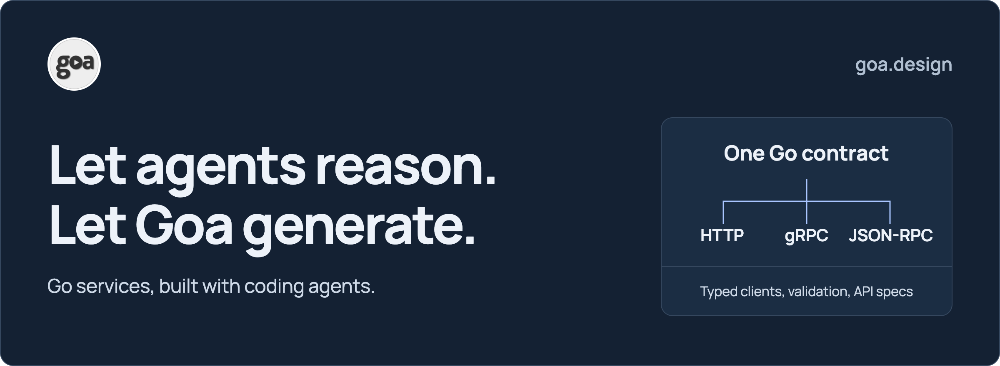
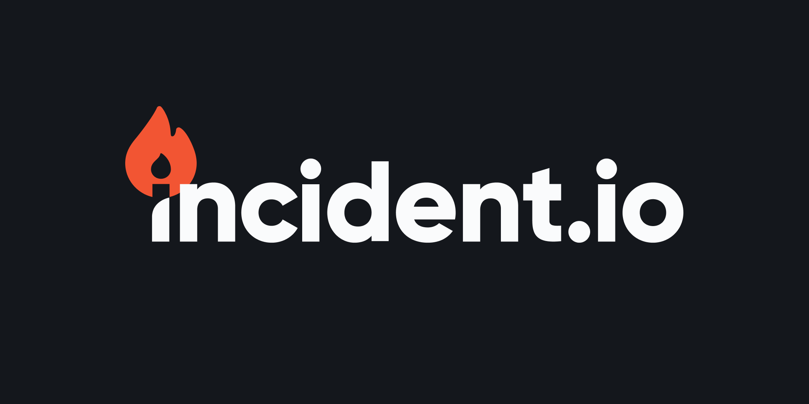
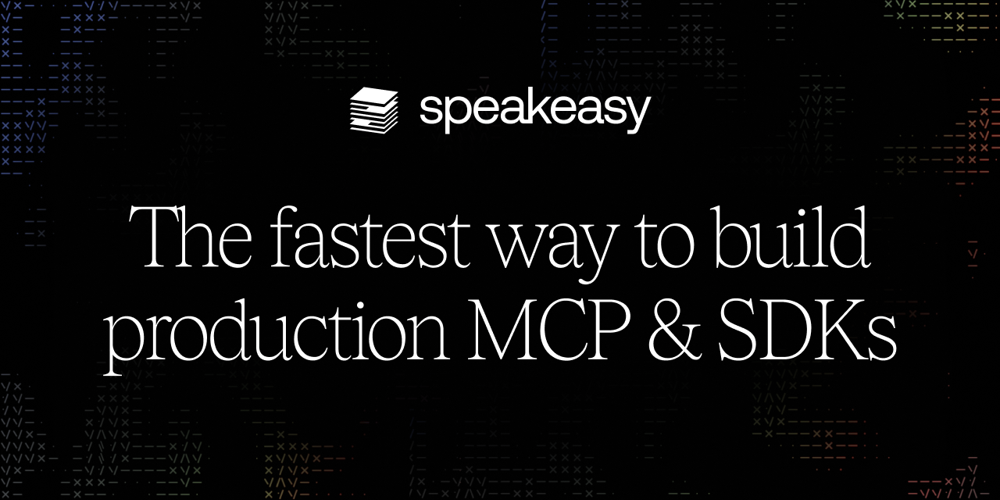

<p align="center">
  <a href="https://goa.design/#gh-light-mode-only">
    <picture>
      <source media="(max-width: 600px)" srcset="docs/goa-banner-mobile.png">
      
    </picture>
  </a>
  <a href="https://goa.design/#gh-dark-mode-only">
    <picture>
      <source media="(max-width: 600px)" srcset="docs/goa-banner-mobile-dark.png">
      
    </picture>
  </a>
</p>

<p align="center">
  <a href="https://github.com/goadesign/goa/releases/latest"></a>
  <a href="https://pkg.go.dev/goa.design/goa/v3@v3.31.1/dsl?tab=doc"></a>
  <a href="https://github.com/goadesign/goa/actions/workflows/test.yml"></a>
  <a href="LICENSE"></a>
</p>

# Go services. Less code to write.

**Goa is a design-first Go framework that generates HTTP, gRPC, and JSON-RPC APIs from a single contract.** Describe your types, operations, and validation in Go. Goa generates the server and client code, CLI clients, and OpenAPI/protobuf specifications. You and your coding agent implement the business logic.

For a coding agent, that's less repetitive code to write, fewer representations to keep in sync, and a clear contract to reason from.

**[Quickstart](https://goa.design/docs/1-goa/quickstart/)** · [Documentation](https://goa.design/docs/1-goa/) · [Examples](https://github.com/goadesign/examples) · [Build AI agents with Goa-AI](https://github.com/goadesign/goa-ai)

## Give your coding agent a contract

A new field can affect a handler, a client, validation, and an API specification. With Goa, your agent changes the design and regenerates those pieces together.

- **Spend tokens on the interesting work.** Goa generates routing, serialization, validation, and clients. Your agent can focus on requirements, business rules, and tests.
- **Start from useful context.** Types, descriptions, examples, errors, and constraints live together in the design. The agent can read the relevant contract before exploring the implementation.
- **Make edits predictable.** Change `design/`, regenerate `gen/`, implement outside it. The same structure carries across services and transports.
- **Let the compiler guide the next step.** When a generated interface changes, Go identifies implementations and callers that need updating. Tests cover the behavior.

Install the **[Goa service designer skill](skills/goa-service-designer/)** in your application repository:

```bash
npx skills add goadesign/goa --skill goa-service-designer
```

The installer requires Node.js and npm and lets you choose your coding tool. The skill guides design changes, generation, implementation, and verification, and points the agent to relevant Goa documentation.

Then give it a real task:

> Add a catalog service with a product lookup by SKU over HTTP and gRPC. Use the Goa service designer skill. Define the contract, generate the code, implement the lookup, and test successful and missing-product responses.

[See the coding-agent workflow](https://goa.design/docs/ai-development/) · [Other skill installation options](skills/)

## One design. Three ways to call it.

This service exposes the same greeting over HTTP, gRPC, and JSON-RPC:

```go
package design

import . "goa.design/goa/v3/dsl"

var _ = Service("hello", func() {
	Description("Greets people by name.")
	JSONRPC(func() {
		POST("/rpc")
	})

	Method("greet", func() {
		Description("Return a personal greeting.")
		Payload(func() {
			Field(1, "name", String, "Name to greet", func() {
				MinLength(1)
			})
			Required("name")
		})
		Result(String)

		HTTP(func() {
			GET("/hello/{name}")
		})
		GRPC(func() {
		})
		JSONRPC(func() {
		})
	})
})
```

Goa generates the three transports, their Go clients, request validation, a CLI client, OpenAPI specifications, and Protocol Buffer definitions. They all call the same generated service interface. Your complete `hello.go` implementation is ordinary Go:

```go
package helloapi

import (
	"context"

	genhello "hello/gen/hello"
)

type hellosrvc struct{}

// NewHello returns the greeting service.
func NewHello() genhello.Service {
	return &hellosrvc{}
}

// Greet returns a greeting for the supplied name.
func (s *hellosrvc) Greet(ctx context.Context, p *genhello.GreetPayload) (string, error) {
	return "Hello, " + p.Name + "!", nil
}
```

Here, `genhello` is the generated `gen/hello` package. The generated transports reject an empty name before calling `Greet`. Add a field or change a validation rule in the design, then regenerate the corresponding code and specifications.

### Try it

Start with **Go 1.26 or later**; Go 1.27.1 is recommended:

```bash
mkdir hello && cd hello
go mod init hello
go get goa.design/goa/v3@latest
mkdir design
```

Save the design above as `design/design.go`. For all three transports, install the [Protocol Buffer compiler](https://protobuf.dev/installation/) and the [Go protobuf generators](UPGRADING.md#install-v3320). For an HTTP-only first run, omit both `JSONRPC` blocks and the `GRPC` block.

Generate the code and starter application:

```bash
go mod tidy
go run goa.design/goa/v3/cmd/goa gen hello/design
go run goa.design/goa/v3/cmd/goa example hello/design
```

Replace the starter `hello.go` with the implementation above, then run:

```bash
go mod tidy
go run ./cmd/hello --http-port=8000
```

In another terminal:

```bash
curl http://localhost:8000/hello/Alice
# "Hello, Alice!"
```

<details>
<summary>Try the generated HTTP, gRPC, and JSON-RPC clients</summary>

If you kept all three transports in the design, each command returns `"Hello, Alice!"`:

```bash
go run ./cmd/hello-cli --url=http://localhost:8000 hello greet --name=Alice
go run ./cmd/hello-cli --url=grpc://127.0.0.1:8080 hello greet --message '{"name":"Alice"}'
go run ./cmd/hello-cli --jsonrpc --url=http://localhost:8000 hello greet --body '{"name":"Alice"}'
```

</details>

`gen` replaces the generated tree. `example` creates missing application files and leaves existing ones alone. Keep your implementation outside `gen/`, and use `go run` as above to run the generator version selected by your module.

For a guided walkthrough, follow the **[HTTP quickstart](https://goa.design/docs/1-goa/quickstart/)**.

## More of your service, generated

| Design in Goa | Get from the generator |
| --- | --- |
| Types, methods, validation, and errors | Typed service interfaces, endpoints, clients, and boundary validation |
| HTTP routes, parameters, headers, and bodies | Server handlers, encoders/decoders, Go clients, CLI commands, and OpenAPI specifications |
| gRPC messages, metadata, and status mappings | Protocol Buffer definitions, server/client adapters, serialization, and CLI commands |
| JSON-RPC methods and error mappings | Server/client code, request dispatch, batches, and notifications |
| Streaming methods | WebSocket and SSE support for HTTP, SSE for JSON-RPC, and gRPC streams |
| Result views | Named response shapes and the code to select and serialize them |

Build on these with [security schemes, interceptors, and production guidance](https://goa.design/docs/1-goa/production/), or extend generation with [plugins](https://github.com/goadesign/plugins).

## One ecosystem. Services and AI agents.

**[Goa-AI](https://github.com/goadesign/goa-ai)** brings the same approach to AI applications. Reuse Goa types and bind tools to service methods, so your API and agent tools share a contract.

- **Build AI agents** with typed tools, structured completions, agent composition, streaming, and evaluation suites.
- **Create MCP servers** that expose tools, resources, and prompts from your design.
- **Host a tool registry** for discovery and invocation across providers.
- **Run locally or durably** with the in-memory engine for local execution or the Temporal engine for durable workflows.

You implement the planner and application behavior; Goa-AI generates contracts, schemas, codecs, and integration code.

**[Explore Goa-AI →](https://github.com/goadesign/goa-ai)** · [Quickstart](https://goa.design/docs/2-goa-ai/quickstart/) · [A service and an agent sharing one design](https://goa.design/docs/ai-development/#one-design-two-entry-points)

## Upgrading to v3.32.0

v3.32.0 fixes client-interceptor imports in generated transport clients and command starters, exposes the corresponding generation-plan query to plugins, and updates dependencies. Goa now requires Go 1.26 or later.

Projects upgrading from v3.30.x must also account for the intentional source and transport changes introduced in v3.31. Read the **[upgrade guide](UPGRADING.md)** before regenerating; it separates those migrations from the v3.32 changes. The [release notes](https://github.com/goadesign/goa/releases/tag/v3.32.0) explain the benefits and fixes.

## Keep exploring

- **Learn the design language:** [DSL reference](https://goa.design/docs/1-goa/dsl-reference/) and [code generation](https://goa.design/docs/1-goa/code-generation/).
- **Choose a transport:** [HTTP guide](https://goa.design/docs/1-goa/http-guide/), [gRPC guide](https://goa.design/docs/1-goa/grpc-guide/), and [JSON-RPC reference](https://pkg.go.dev/goa.design/goa/v3/dsl#JSONRPC).
- **See complete applications:** [Examples](https://github.com/goadesign/examples) cover security, streaming, file uploads, interceptors, tracing, and more.
- **Give an agent focused documentation:** Start with [llms.txt](https://goa.design/llms.txt), then load the relevant guide's Markdown version.

## Sponsors

Goa is supported by these sponsors. Thank you for helping keep the project growing.

<table>
  <tr>
    <td align="center" width="50%">
      <a href="https://www.incident.io"></a>
      <h3>Bounce back stronger after every incident</h3>
      <p>Run incidents end-to-end. Rapidly fix and learn from incidents, so you can build more resilient products.</p>
      <a href="https://incident.io">Explore incident.io →</a>
    </td>
    <td align="center" width="50%">
      <a href="https://www.speakeasy.com/editor?utm_source=goa+repo&utm_medium=github+sponsorship"></a>
      <h3>Enterprise DevEx for your API</h3>
      <p>Create feature-rich SDKs. Speed up integrations and reduce errors by giving your API the DevEx it deserves.</p>
      <a href="https://www.speakeasy.com/docs/api-frameworks/goa?utm_source=goa+repo&utm_medium=github+sponsorship">Integrate with Goa →</a>
    </td>
  </tr>
</table>

## Join the community

Questions, ideas, and contributions are welcome.

- **Talk with us:** [Gophers Slack #goa](https://gophers.slack.com/messages/goa/) and [GitHub Discussions](https://github.com/goadesign/goa/discussions).
- **Get help:** [Goa Guru](https://gurubase.io/g/goa) and [Goa Design Wizard](https://chat.openai.com/g/g-mLuQDGyro-goa-design-wizard).
- **Follow along:** [Bluesky](https://bsky.app/profile/goadesign.bsky.social) and [Design First on Substack](https://goadesign.substack.com).
- **Contribute:** [Report a bug](https://github.com/goadesign/goa/issues) or [open a pull request](https://github.com/goadesign/goa/pulls).

MIT licensed. See [LICENSE](LICENSE) · [Go Report Card](https://goreportcard.com/report/github.com/goadesign/goa).
